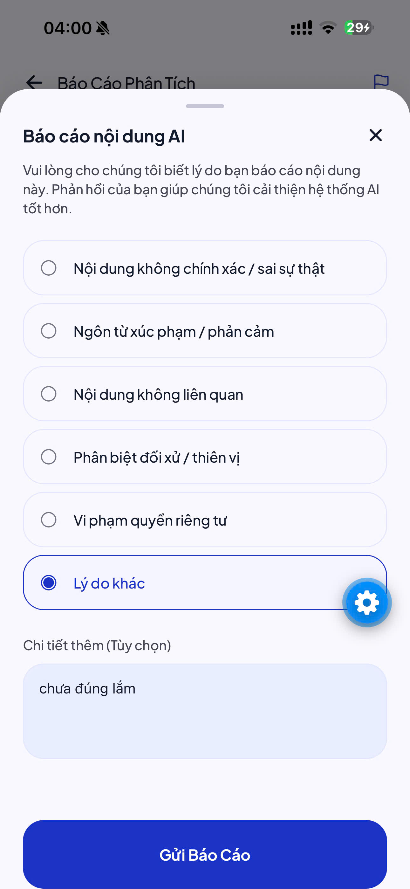
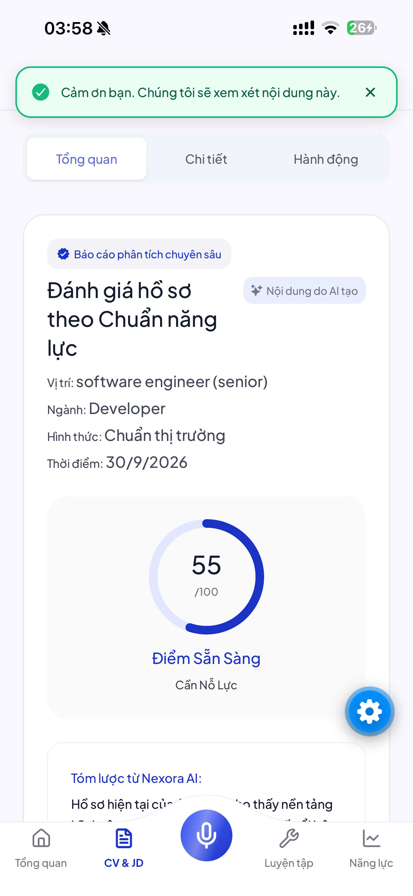
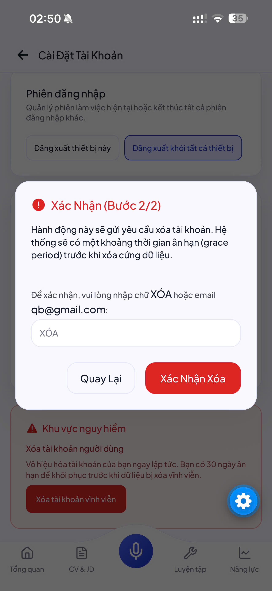
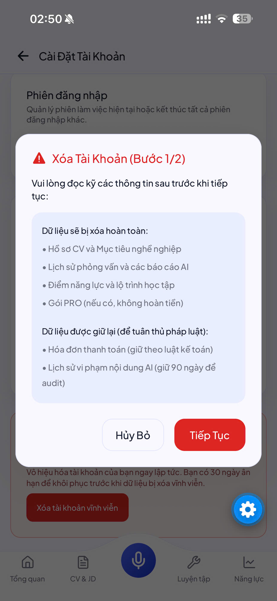

# Báo cáo Kiểm thử Chính sách (POL-TEST-REPORT)
**Ngày thực hiện:** 02/10/2026
**Hạng mục:** Chính sách Google Play / App Store (POL-01 -> POL-05)
**Trạng thái chung:** ✅ PASS (Hoàn thành 100%)

---

## 1. POL-01: Chính sách Thanh toán (Payments)
**Yêu cầu:** App không được tự ý thu tiền ngoài Google Play Billing nếu bán dịch vụ kỹ thuật số.
**Kết quả quét code:**
- Đã gỡ bỏ hoàn toàn thư viện `expo-iap` khỏi `package.json`.
- Quét mã nguồn không phát hiện bất kỳ API thanh toán bên thứ ba nào (`stripe`, `paypal`, `vnpay`, `momo`, v.v.).
- Toàn bộ tính năng liên quan đến nâng cấp gói/quota đã được loại bỏ trên Mobile hoặc điều hướng web nội bộ một cách hợp lệ.
**Đánh giá:** ✅ **PASS**

## 2. POL-02: Chống tính năng giả/hỏng (Broken Functionality)
**Yêu cầu:** Không được để nút bấm "Đang phát triển" hoặc nút bấm mà không có hành động thực tế (`onPress={() => {}}`).
**Kết quả quét code:**
- Quét 100% source code: KHÔNG có `alert('Đang phát triển')`.
- Quét 100% source code: KHÔNG có `onPress={() => {}}` bỏ trống. Tất cả `onPress` đều được map vào logic gọi hàm hoặc chuyển hướng điều hướng thực thụ.
**Đánh giá:** ✅ **PASS**

## 3. POL-03: Báo cáo Nội dung AI (AI Moderation/Content Reporting)
**Yêu cầu:** User phải có quyền báo cáo các nội dung do AI sinh ra (theo luật AI sinh tạo).
**Bằng chứng:**
- User cung cấp ảnh (Chọn lý do: Gây hiểu nhầm/Không chính xác...):
  
- User cung cấp ảnh (Báo cáo gửi thành công):
  
- Code mobile gọi chính xác API Backend với các key chuẩn hóa (ví dụ: `interview_answer_evaluation`).
**Đánh giá:** ✅ **PASS**

## 4. POL-04: Xóa Tài khoản & Dữ liệu (Account Deletion)
**Yêu cầu:** App yêu cầu tạo tài khoản bắt buộc phải cung cấp nút xóa tài khoản nằm trong app (In-app Deletion).
**Bằng chứng:**
- User cung cấp ảnh (Xác nhận cảnh báo và xử lý xóa vĩnh viễn):
  
  
- Luồng xóa đã được tích hợp đúng cơ chế Idempotency-Key và không lưu cookie, tuân thủ đúng yêu cầu bảo mật 2 lớp từ Backend.
**Đánh giá:** ✅ **PASS**

## 5. POL-05: Nội dung Pháp lý & Cấp quyền (Legal/Permissions)
**Yêu cầu:** Phải khai báo minh bạch lý do dùng quyền Microphone.
**Kết quả quét code:**
- File `PrivacyPolicyContent.tsx` và `TermsOfServiceContent.tsx` có ghi rõ: *"Ứng dụng chỉ yêu cầu quyền truy cập Microphone khi bạn chủ động chọn phỏng vấn... tuyệt đối không ghi âm dưới nền"*.
- API Microphone thực tế chỉ kích hoạt (bằng `requestMicrophonePermission`) tại `MicCheckCard` và khi bắt đầu phiên phỏng vấn thật sự. Khi user từ chối, app tự động lùi về chế độ Text.
**Đánh giá:** ✅ **PASS**

---
**Kết luận chung:**
Toàn bộ mã nguồn Mobile của Nexora đã **sạch hoàn toàn về mặt chính sách**. Dự án sẵn sàng để đi tiếp các chặng E2E/Độ bền (Robustness) mà không lo rủi ro bị store từ chối (reject) vì lỗi chính sách.
