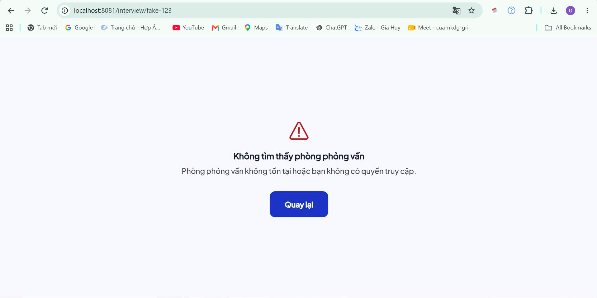
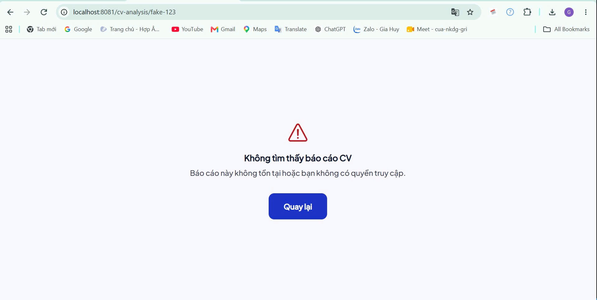

# HƯỚNG DẪN KIỂM THỬ BẢO MẬT 14 CASES (SEC-01 -> SEC-14)

> **Mục đích:** Phân chia công việc rõ ràng giữa **Người dùng (Test trên Expo Go iOS)** và **AI (Quét mã nguồn tự động)** để hoàn thành kiểm thử bảo mật 14 cases SEC theo đúng yêu cầu của `05-TEST-PLAN.md`.

---

## 🟢 1. CÁC CASE NGƯỜI DÙNG TEST TRÊN EXPO GO (iOS) & CHỤP HÌNH BẰNG CHỨNG

Bạn thực hiện 5 case thực tế này trên ứng dụng **Expo Go** (điện thoại iPhone) và chụp lại **4 bức ảnh bằng chứng**:

| Case ID | Test ở đâu trên App? | Thao tác test thế nào? | Chụp hình bằng chứng |
|---|---|---|---|
| **SEC-05** | Màn hình Profile & Lịch sử phỏng vấn | 1. Đăng nhập Acc A -> Xem dữ liệu. 2. Logout Acc A. 3. Đăng nhập Acc B ngay lập tức. | ✅ **Đã test:**   [Video Bằng Chứng SEC-05](./SEC-05-Test.mp4) |
| **SEC-06** | Toàn bộ App | Đăng nhập -> Vuốt tắt hẳn app Expo Go trên iPhone -> **Mở lại app (Giữ nguyên Wi-Fi để Expo load được code)**. | ✅ **Đã test:**   [Video Bằng Chứng SEC-06](./SEC-06-Test.mp4) |
| **SEC-08** | Bất kỳ màn hình nào | **(Mô phỏng lỗi mạng trên Expo):** Tắt Wi-Fi/Internet trên **máy tính Laptop** (để Backend/API không phản hồi) nhưng vẫn giữ Wi-Fi trên điện thoại -> Bấm nút Gửi yêu cầu/Tải trang trên điện thoại. | ✅ **Đã test:**   [Video Bằng Chứng SEC-08](./SEC-08-Test.mp4) |
| **SEC-11** | Màn hình Upload CV (`(app)/resumes`) | Bấm Upload CV -> Chọn một file không hợp lệ hoặc file dung lượng quá lớn (>50MB). | ✅ **Đã test:**   [Video Bằng Chứng SEC-11](./SEC-11-Test.mp4) |
| **SEC-03 & SEC-04** | Màn hình Bài phỏng vấn / CV | **(Test trên Web PC cho dễ):** Tại cửa sổ terminal `npx expo start`, bấm phím `w` để mở app trên trình duyệt web. Đăng nhập, sau đó trên thanh địa chỉ (URL), gõ thủ công một đường dẫn chứa ID giả: `http://localhost:8081/interview/fake-123` hoặc `http://localhost:8081/cv-analysis/fake-123` rồi Enter. | ✅ **Đã test:**        |

---

## 🤖 2. CÁC CASE AI SẼ TỰ ĐỘNG AUDIT BẰNG CODE TRÊN PC
*(Bạn **KHÔNG CẦN** làm gì, AI sẽ tự quét mã nguồn và sinh file bằng chứng `.txt`/`.md` chuẩn vào `docs/evidence/security/`)*

- **SEC-01 (Check Logcat Scrubbing):** AI quét mã nguồn logger regex loại bỏ toàn bộ `console.log` chứa Token/PII -> Sinh `./P1-01-no-token-in-logcat.txt`.
- **SEC-02 (Auth Guard Deep Link):** AI soi file code `(app)/_layout.tsx` kiểm tra logic chặn 12 routes -> Sinh `./P1-04-deeplink-guard.txt`.
- **SEC-07 (Refresh Token Rotation):** AI kiểm tra logic Axios Interceptor xử lý xoay vòng Token trong `src/api/client.ts`.
- **SEC-09 (HTTPS / Cleartext):** AI soi file `android/app/src/main/AndroidManifest.xml` & `app.json` chặn HTTP cleartext (`usesCleartextTraffic: false`).
- **SEC-10 (Dọn Cache PII):** AI soi code logic dọn sạch file tạm sau khi upload CV -> Sinh `./P1-08-cache-cleanup.txt`.
- **SEC-12 (Check Quyền App):** AI kiểm tra danh sách Permissions tối thiểu trong `AndroidManifest.xml` -> Sinh `./final-permissions.md`.
- **SEC-13 (Sentry Scrubbing):** AI soi cấu hình logger Sentry (`src/utils/logger.ts`) lọc bỏ thông tin nhạy cảm.
- **SEC-14 (Minify / Obfuscation):** AI kiểm tra cấu hình build Release R8 trong `app.json` (`enableMinifyInReleaseBuilds: true`).

---

## 📁 3. LƯU THƯ MỤC BẰNG CHỨNG

- Tất cả file ảnh bạn chụp và các file log do AI tạo ra sẽ được lưu trữ tại:
  `c:\Users\Admin\Desktop\Desktop\Fe\nexora-mobile\docs\evidence\security\`

---
*Tài liệu được khởi tạo ngày 2026-10-01 phục vụ kiểm thử bảo mật Nexora Mobile.*
